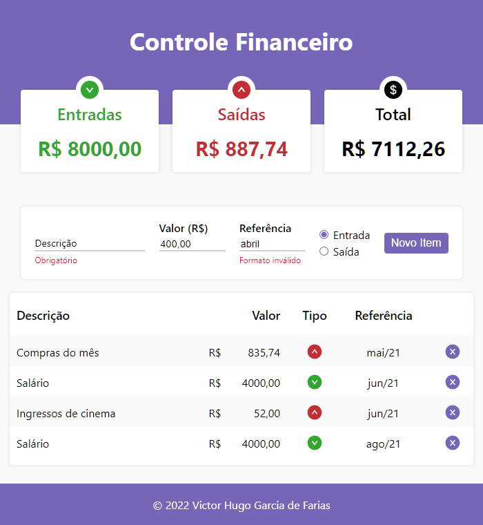

<h1 align="center">Controle Financeiro</h1>

Uma lista de controle de gastos simples na qual podem ser inseridas entradas e saídas com uma descrição, valor e uma referência. As informações persistem no LocalStorage e os valores totais são atualizados automaticamente. Este projeto é baseado neste [vídeo](https://www.youtube.com/watch?v=pj4vA67olbU) do canal [Will Dev](https://www.youtube.com/channel/UCLTb4X0OBfp9rRGkhOcktbQ) do Youtube.

Você pode conferir o app aqui: 

### Tecnologias e Bibliotecas

- Node.js e React (create-react-app e react-icons)

### Instalação e Utilização

1. Clonar ou baixar este repositório
1. Instalar as dependências do projeto usando <code>npm install</code>
1. Executar <code>npm run build</code>
1. Abrir o arquivo <code>index.html</code> gerado na pasta <code>build</code>

### Planos Futuros

- Validação dos campos do formulário de nova entrada
- Filtragem da lista por valor de referência
- Categorização da entrada/saída em grupos

